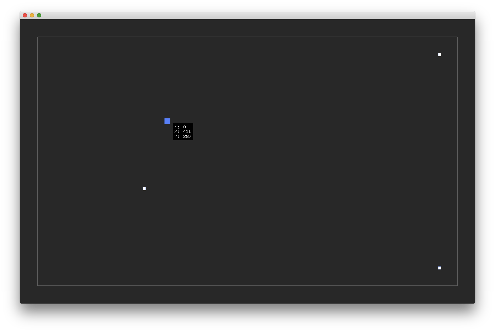

# ofxControlPointManager
  
  
## Usage
see example.

```
click point     -> select
click space     -> unselect
Cmd( Ctrl ) + A -> select all
drag point      -> move
drag space      -> multiple select
arrow key       -> move 1px
```  
and supports `Command`( or `Ctrl`, `Shft`) +  `click` ( or `drag` )!  
  
## License
MIT  
